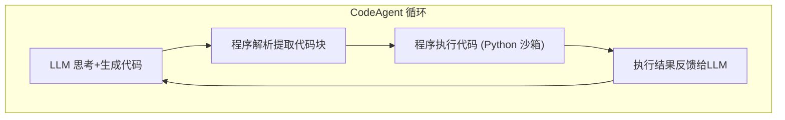
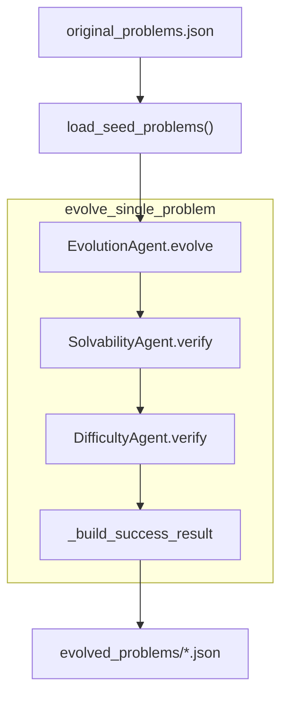

# Code2Math-CLI

CLI 实现 [Code2Math](https://github.com/TarferSoul/Code2Math) 的数学题目演化 Pipeline。基于多智能体架构，利用 LLM 将种子数学题目演化为难度更高的新题目，并通过自动化验证确保可解性和难度提升。

**论文**：[Code2Math: Can Your Code Agent Effectively Evolve Math Problems Through Exploration?](https://arxiv.org/abs/2603.03202) (arXiv:2603.03202)

---

## 快速开始

### 环境要求

- [UV](https://docs.astral.sh/uv/)（推荐）或 Python 3.12
- 使用 UV 创建虚拟环境并安装依赖

### 安装

```bash
uv venv --python 3.12
uv pip install -r requirements.txt
```

主要依赖：`smolagents[openai]`、`pydantic`、`pyyaml`、`click`、`sympy`、`numpy`、`scipy`、`networkx`、`z3-solver`。

### 配置

复制 `.env.example` 为 `.env`，填入 API Key、API 端点和模型 ID：

```bash
cp .env.example .env
# 编辑 .env，设置 CODE2MATH_API_KEY、CODE2MATH_API_BASE、CODE2MATH_MODEL_ID
```

其余参数（temperature、max_tokens 等）在 `config/default.yaml` 中配置。

### 运行

```bash
uv run python cli.py evolve --problems 0 --max-rollouts 1
```

**数据目录**：`original_problems.json`（种子题）、`prompts/math_demonstrations/`（演化示例）、`evolved_problems/`（输出）。

---

## Pipeline 架构

串行三阶段，每道题目依次经过：

| 阶段 | 名称 | 职责 | 判定标准 |
|------|------|------|----------|
| Stage 1 | **Evolution** | 将原始题目演化为更难的新题目 | 返回合法的 `{new_problem, new_solution_steps, new_answer}` |
| Stage 2 | **Solvability** | 验证新题目的数学正确性和可解性 | `status == "PASS"` |
| Stage 3 | **Difficulty** | 评估新题目相对于原题的难度提升 | `score >= 3`（即 `status == "PASS"`） |

三阶段全部通过才判定为 SUCCESS；任一阶段失败则进入下一轮 rollout 重试。

---

## CodeAgent 机制

三个 Agent 均基于 `smolagents.CodeAgent`，核心是 **思考-行动-观察** 循环：



| 职责 | 执行者 |
|------|--------|
| 思考、生成 Python 代码 | LLM |
| 解析代码块、执行代码 | 程序（smolagents + LatexSafeExecutor） |
| 调用 `final_answer()` 返回结果 | LLM |

**LatexSafeExecutor**：数学题中 LaTeX 表达式（如 `\frac`, `\alpha`）在 Python 字符串中可能被误解析为转义字符，执行器会在执行后自动修复。

---

## 三阶段说明

### Evolution

- **目标**：生成概念难度更高的新题（Golden Rule：负担发现 > 计算复杂度）
- **输入**：原题 + 6 个 demonstration
- **输出**：`new_problem`, `new_solution_steps`, `new_answer`
- **流程**：分析 → 用代码探索 → 构建新题 → `final_answer()`

### Solvability

- **目标**：验证数学正确性，充当「数学防火墙」
- **两阶段审计**：Phase 1 静态检查（定义域、约束）→ Phase 2 逐步逻辑审计（SymPy 验证每步推导）
- **输出**：`status`, `reason`
- **8 类红旗**：Transformation Error、Over Generalization、Invalid Construction、Wrong Division、Circular Reasoning、Logic Violation、Hidden Assumption、Boundary Neglect

### Difficulty

- **目标**：评估「burden of discovery」是否真正提升
- **输入**：原题 + 新题 + 6 个 demonstration（评分校准）
- **输出**：`status`, `score`, `reason`
- **评分**：1–2 分 FAIL，3–5 分 PASS；4 分表示抗模板化 + 需要非平凡 Aha moment

---

## 数据流



**输出 JSON 结构**：`status`、`result_data`（含 `new_problem`、`solvability_verifier_output`、`difficulty_verifier_output`）、`failure_counts`、`original_problem`、`problem_id`。失败时若 Evolution 已通过，`new_problem` 会保留最后一次演化结果，便于分析失败原因。

> **格式说明**：本项目使用 `problem_id`（int）标识题目，与上游 Code2Math 的 `"id"`（string）格式不同。若需与上游工具或数据集混用，可自行转换。

---

## 失败与重试

- **Rollout 循环**：某阶段失败则 `failure_counts` 对应 +1，进入下一轮 rollout
- **max_rollouts**：默认 20，CLI 可覆盖 `--max-rollouts N`
- **Resume**：`--resume` 可跳过已成功题目，从输出文件继续
- **并发**：`--workers N` 支持多题目并行

---

## 关键文件

| 路径 | 功能 |
|------|------|
| `cli.py` | CLI 入口，`evolve` 命令 |
| `pipeline/orchestrator.py` | Pipeline 编排，rollout 循环 |
| `agents/evolution_agent.py` | Evolution Agent |
| `agents/solvability_agent.py` | Solvability Agent |
| `agents/difficulty_agent.py` | Difficulty Agent |
| `agents/base.py` | `create_code_agent` 工厂 |
| `agents/executor.py` | LatexSafeExecutor |
| `agents/parsing.py` | 结果解析 |
| `prompts/prompt_math.py` | 三阶段 prompt 模板 |
| `config/settings.py` | Code2MathConfig |
| `utils/loader.py` | 种子题、demo、已有结果加载 |
| `utils/saver.py` | ResultSaver |
| `utils/cli_helpers.py` | parse_problem_ids |

---

## 链接

- 论文：[arXiv:2603.03202](https://arxiv.org/abs/2603.03202)
- 原项目：[github.com/TarferSoul/Code2Math](https://github.com/TarferSoul/Code2Math)
